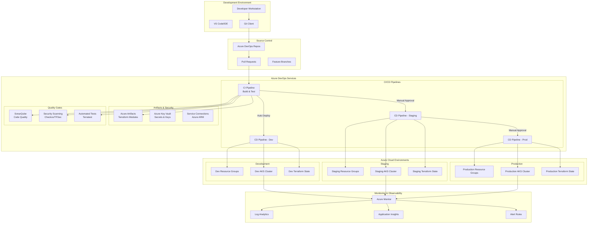
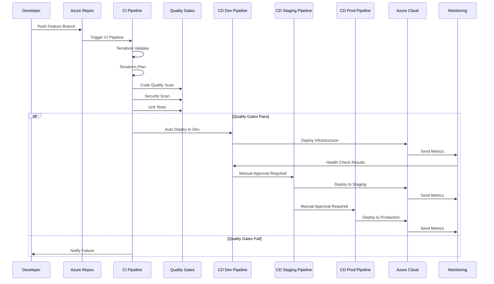
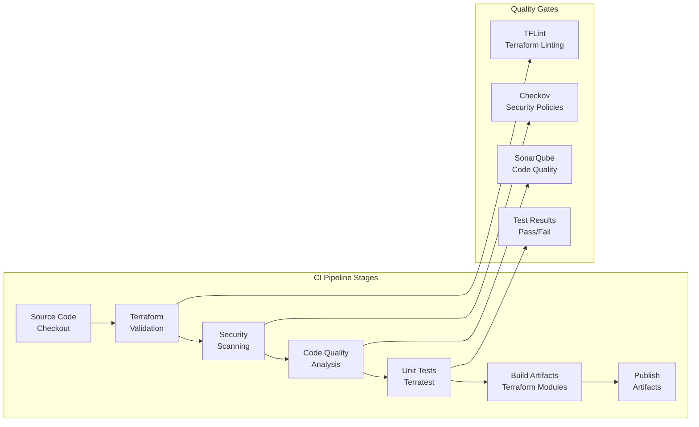
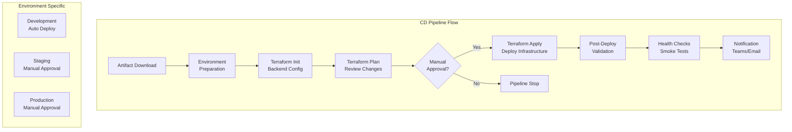
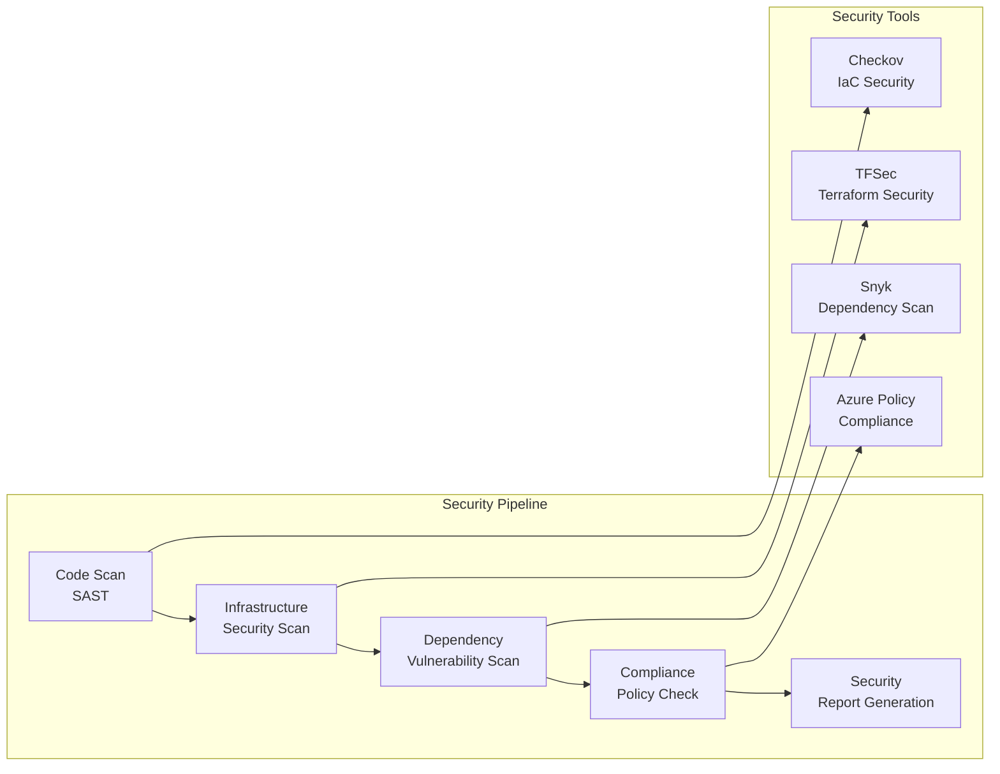
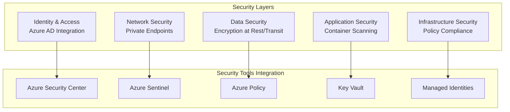
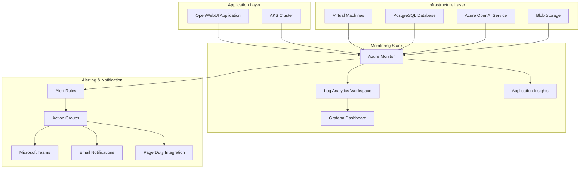
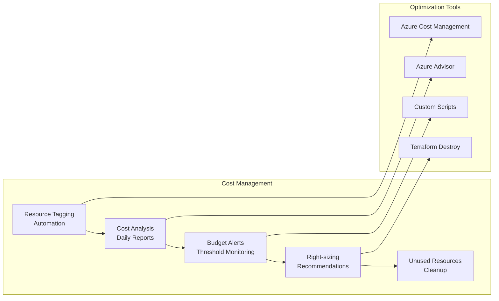

# Complete CI/CD Pipeline Architecture for Azure Infrastructure

## 🎯 Overview

This document outlines a comprehensive CI/CD pipeline solution for the Azure Infrastructure project using Azure DevOps, following industry best practices and standards for Infrastructure as Code (IaC) deployment.

## 🏗️ Solution Architecture

### High-Level CI/CD Architecture



### Detailed Pipeline Flow



## 🔧 Pipeline Components Breakdown

### 1. Continuous Integration (CI) Pipeline



### 2. Continuous Deployment (CD) Pipeline



### 3. Security & Compliance Pipeline



## 📋 Pipeline Stages Detailed

### Stage 1: Source Control & Branching Strategy

```mermaid
gitgraph
    commit id: "Initial"
    branch develop
    checkout develop
    commit id: "Feature 1"
    branch feature/aks-upgrade
    checkout feature/aks-upgrade
    commit id: "AKS Changes"
    checkout develop
    merge feature/aks-upgrade
    commit id: "Merge Feature"
    checkout main
    merge develop
    commit id: "Release v1.0"
    branch hotfix/security-patch
    checkout hotfix/security-patch
    commit id: "Security Fix"
    checkout main
    merge hotfix/security-patch
    commit id: "Hotfix v1.0.1"
```

### Stage 2: Build & Validation Pipeline

**Terraform Validation Steps:**
1. **Syntax Check**: `terraform fmt -check`
2. **Configuration Validation**: `terraform validate`
3. **Security Scanning**: Checkov, TFSec
4. **Linting**: TFLint with custom rules
5. **Plan Generation**: `terraform plan` for each environment

### Stage 3: Testing Pipeline

**Testing Strategy:**
1. **Unit Tests**: Terratest for module testing
2. **Integration Tests**: End-to-end infrastructure testing
3. **Security Tests**: Policy compliance validation
4. **Performance Tests**: Resource provisioning time
5. **Smoke Tests**: Basic connectivity and functionality

### Stage 4: Deployment Pipeline

**Deployment Strategy:**
1. **Blue-Green Deployment**: For zero-downtime updates
2. **Canary Deployment**: Gradual rollout for production
3. **Rollback Strategy**: Automated rollback on failure
4. **Health Checks**: Post-deployment validation

## 🔐 Security & Compliance

### Security Implementation



### Compliance Framework

| Compliance Area | Implementation | Tools |
|-----------------|----------------|-------|
| **Infrastructure Security** | Checkov policies, TFSec rules | Checkov, TFSec, Azure Policy |
| **Data Protection** | Encryption, backup policies | Azure Key Vault, Backup policies |
| **Access Control** | RBAC, Managed Identities | Azure AD, RBAC assignments |
| **Network Security** | NSGs, Private Endpoints | Network policies, Firewall rules |
| **Monitoring & Auditing** | Comprehensive logging | Azure Monitor, Log Analytics |

## 📊 Monitoring & Observability

### Monitoring Architecture



### Key Metrics & KPIs

| Category | Metrics | Thresholds |
|----------|---------|------------|
| **Infrastructure** | CPU, Memory, Disk, Network | CPU > 80%, Memory > 85% |
| **Application** | Response time, Error rate, Throughput | Response > 2s, Error > 5% |
| **Database** | Connection count, Query performance | Connections > 80%, Query > 1s |
| **Security** | Failed logins, Policy violations | > 10 failures/hour |
| **Cost** | Resource utilization, Budget alerts | > 90% of budget |

## 💰 Cost Management

### Cost Optimization Pipeline



### Cost Control Measures

1. **Automated Tagging**: Consistent resource tagging for cost allocation
2. **Budget Alerts**: Proactive cost monitoring and alerts
3. **Resource Scheduling**: Auto-shutdown for non-production environments
4. **Right-sizing**: Regular analysis and optimization recommendations
5. **Cleanup Automation**: Automated removal of unused resources

## 🚀 Implementation Roadmap

### Phase 1: Foundation (Weeks 1-2)
- [ ] Azure DevOps project setup
- [ ] Service connections configuration
- [ ] Basic CI pipeline implementation
- [ ] Terraform state management setup

### Phase 2: Core Pipeline (Weeks 3-4)
- [ ] Complete CI/CD pipeline implementation
- [ ] Security scanning integration
- [ ] Quality gates configuration
- [ ] Multi-environment deployment

### Phase 3: Advanced Features (Weeks 5-6)
- [ ] Monitoring and alerting setup
- [ ] Cost management implementation
- [ ] Performance optimization
- [ ] Documentation and training

### Phase 4: Production Readiness (Weeks 7-8)
- [ ] Security hardening
- [ ] Disaster recovery testing
- [ ] Performance testing
- [ ] Go-live preparation

## 📚 Best Practices Implementation

### Infrastructure as Code (IaC)
- **Modular Design**: Reusable Terraform modules
- **Version Control**: All infrastructure code in Git
- **State Management**: Remote state with locking
- **Documentation**: Comprehensive module documentation

### CI/CD Best Practices
- **Pipeline as Code**: YAML-based pipeline definitions
- **Automated Testing**: Comprehensive test coverage
- **Security First**: Security scanning at every stage
- **Fail Fast**: Early detection of issues

### Security Best Practices
- **Least Privilege**: Minimal required permissions
- **Secrets Management**: Azure Key Vault integration
- **Network Security**: Private endpoints and NSGs
- **Compliance**: Automated policy enforcement

### Operational Excellence
- **Monitoring**: Comprehensive observability
- **Alerting**: Proactive issue detection
- **Documentation**: Up-to-date operational guides
- **Training**: Team knowledge sharing

## 🔧 Tools & Technologies

### Core Technologies
- **Azure DevOps**: CI/CD platform
- **Terraform**: Infrastructure as Code
- **Azure CLI**: Command-line interface
- **PowerShell**: Automation scripting
- **Docker**: Containerization

### Quality & Security Tools
- **Checkov**: Infrastructure security scanning
- **TFSec**: Terraform security analysis
- **SonarQube**: Code quality analysis
- **Snyk**: Dependency vulnerability scanning
- **TFLint**: Terraform linting

### Monitoring & Observability
- **Azure Monitor**: Native monitoring service
- **Log Analytics**: Centralized logging
- **Application Insights**: Application performance monitoring
- **Grafana**: Custom dashboards
- **Prometheus**: Metrics collection

This comprehensive CI/CD architecture provides a robust, secure, and scalable solution for managing Azure infrastructure deployments with industry-standard practices and tools.