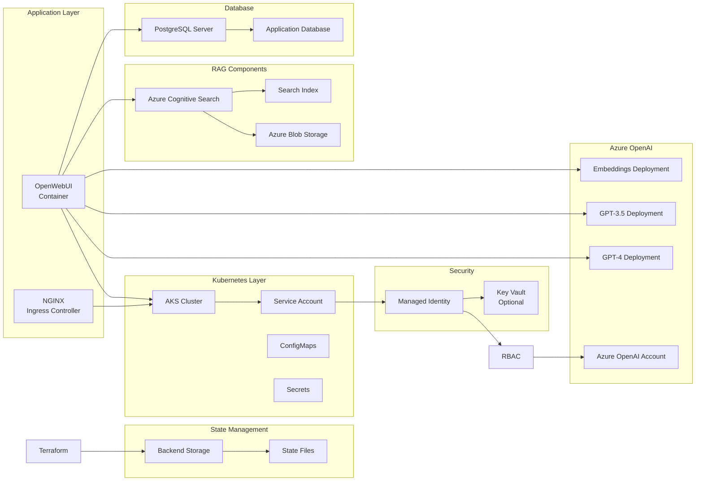
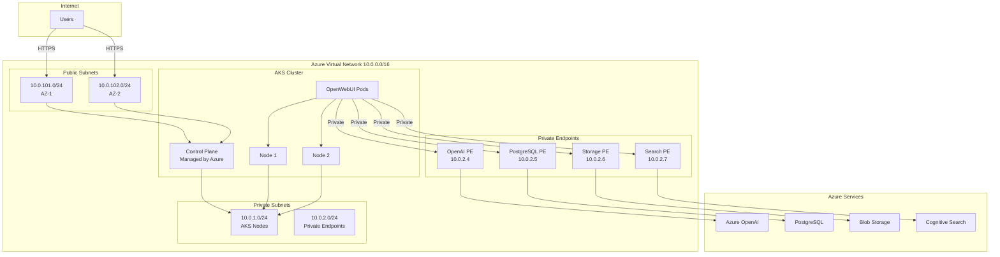
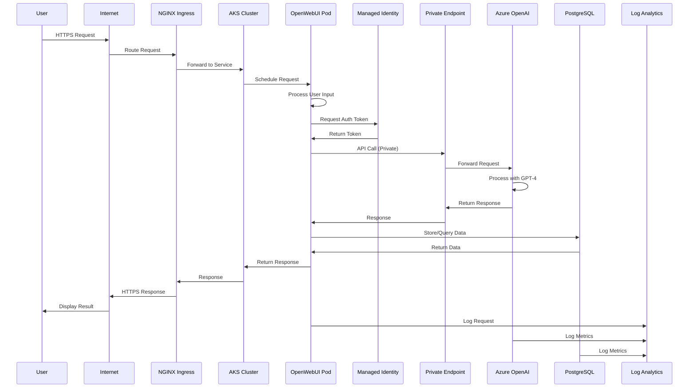

# Azure Infrastructure for OpenWebUI

Complete Azure cloud infrastructure for deploying OpenWebUI on Azure Kubernetes Service (AKS) with Azure OpenAI Service integration, PostgreSQL database, and enterprise-grade state management.

## 📋 Table of Contents

- [Overview](#overview)
- [Architecture](#architecture)
- [Quick Start](#quick-start)
- [Infrastructure Components](#infrastructure-components)
- [Configuration](#configuration)
- [Modules](#modules)
- [Security](#security)
- [Monitoring](#monitoring)
- [Cost Optimization](#cost-optimization)
- [Documentation](#documentation)

## 🎯 Overview

This infrastructure provides a production-ready Azure deployment for OpenWebUI with:

- **Azure Kubernetes Service (AKS)**: Managed Kubernetes cluster with auto-scaling
- **Azure OpenAI Service**: Enterprise LLM access with GPT-4, GPT-3.5, and embeddings
- **Azure Database for PostgreSQL**: Managed database with high availability
- **Azure Virtual Network**: Secure network isolation with private endpoints
- **Remote State Management**: Environment-specific Terraform state storage
- **Azure Monitor & Log Analytics**: Comprehensive monitoring and logging
- **Azure Cognitive Search**: RAG (Retrieval-Augmented Generation) capabilities

## 🏗️ Architecture

### Complete System Architecture

```mermaid
graph TB
    subgraph "Azure Cloud"
        subgraph "Resource Groups"
            subgraph "Application Resources"
                subgraph "Networking Layer"
                    VNet[Virtual Network<br/>10.0.0.0/16]
                    PubSub[Public Subnets<br/>10.0.101.0/24<br/>10.0.102.0/24]
                    PrivSub[Private Subnets<br/>10.0.1.0/24<br/>10.0.2.0/24]
                    NSG[Network Security Groups]
                    RT[Route Tables]
                end
                
                subgraph "Compute Layer"
                    AKS[Azure Kubernetes Service<br/>AKS Cluster]
                    NodePool[Node Pools<br/>Auto-scaling Enabled]
                    Pods[OpenWebUI Pods]
                end
                
                subgraph "AI Services Layer"
                    OpenAI[Azure OpenAI Service<br/>GPT-4, GPT-3.5, Embeddings]
                    CogSearch[Azure Cognitive Search<br/>RAG Support]
                    Storage[Azure Blob Storage<br/>Knowledge Base]
                end
                
                subgraph "Data Layer"
                    PostgreSQL[Azure Database<br/>for PostgreSQL]
                    DBBackup[Automated Backups]
                end
                
                subgraph "Identity & Access"
                    MI[Managed Identities<br/>User-Assigned]
                    RBAC[Azure RBAC<br/>Role Assignments]
                end
                
                subgraph "Monitoring & Logging"
                    LogAnalytics[Log Analytics Workspace]
                    Monitor[Azure Monitor<br/>Metrics & Alerts]
                    ActionGroup[Action Groups<br/>Alert Notifications]
                end
                
                subgraph "Private Connectivity"
                    PE_OpenAI[OpenAI Private Endpoint]
                    PE_DB[Database Private Endpoint]
                    PE_Storage[Storage Private Endpoint]
                    PrivateDNS[Private DNS Zones]
                end
            end
            
            subgraph "State Management Resources"
                BackendRG[Terraform State RG]
                BackendSA[Storage Account<br/>State Files]
                BackendContainer[Blob Container<br/>tfstate/]
            end
        end
    end
    
    Users[Users/Applications] -->|HTTPS| AKS
    AKS -->|Private Endpoint| OpenAI
    AKS -->|Private Endpoint| PostgreSQL
    AKS -->|Private Endpoint| CogSearch
    AKS -->|Private Endpoint| Storage
    AKS -->|Managed Identity| MI
    OpenAI -->|Logs| LogAnalytics
    PostgreSQL -->|Logs| LogAnalytics
    AKS -->|Metrics| Monitor
    Monitor -->|Alerts| ActionGroup
    VNet --> PubSub
    VNet --> PrivSub
    PubSub --> NSG
    PrivSub --> NSG
    PrivSub --> RT
    AKS --> PrivSub
    PE_OpenAI --> PrivSub
    PE_DB --> PrivSub
    PE_Storage --> PrivSub
    PE_OpenAI --> PrivateDNS
    PE_DB --> PrivateDNS
    PE_Storage --> PrivateDNS
    BackendSA --> BackendContainer
```



### Component Breakdown



### Network Architecture



### Data Flow Architecture



## 🚀 Quick Start

### Prerequisites

1. **Azure Subscription**: Active Azure subscription with appropriate permissions
2. **Azure CLI**: Installed and configured (`az login`)
3. **Terraform**: Version >= 1.0
4. **kubectl**: Kubernetes command-line tool

### Quick Deployment

```bash
# 1. Clone the repository
git clone <repository-url>
cd Terraform-EKS-Test/terraform

# 2. Navigate to environment directory
cd environments/dev

# 3. Configure variables
cp terraform.tfvars.example terraform.tfvars
# Edit terraform.tfvars with your Azure subscription details

# 4. Initialize Terraform
terraform init

# 5. Review the plan
terraform plan

# 6. Apply the configuration
terraform apply
```

## 📁 Directory Structure

```
Terraform-EKS-Test/
├── terraform/
│   ├── main.tf                          # Main Terraform configuration
│   ├── variables.tf                     # Variable definitions
│   ├── outputs.tf                       # Output definitions
│   ├── modules/
│   │   ├── vnet/                        # Virtual Network module
│   │   │   ├── main.tf
│   │   │   ├── variables.tf
│   │   │   └── outputs.tf
│   │   ├── aks/                         # AKS cluster module
│   │   │   ├── main.tf
│   │   │   ├── variables.tf
│   │   │   └── outputs.tf
│   │   ├── openai/                      # Azure OpenAI module
│   │   │   ├── main.tf
│   │   │   ├── variables.tf
│   │   │   └── outputs.tf
│   │   ├── database/                    # PostgreSQL database module
│   │   │   ├── main.tf
│   │   │   ├── variables.tf
│   │   │   └── outputs.tf
│   │   └── backend/                     # Backend storage module
│   │       ├── main.tf
│   │       ├── variables.tf
│   │       └── outputs.tf
│   ├── environments/
│   │   ├── dev/
│   │   │   ├── backend.tf               # Backend configuration
│   │   │   └── terraform.tfvars         # Environment variables
│   │   ├── staging/
│   │   │   ├── backend.tf
│   │   │   └── terraform.tfvars
│   │   └── prod/
│   │       ├── backend.tf
│   │       └── terraform.tfvars
│   ├── scripts/                         # Deployment scripts
│   ├── AZURE_ARCHITECTURE.md           # Architecture documentation
│   ├── AZURE_SOLUTION_ARCHITECTURE.md  # Detailed solution architecture
│   ├── AZURE_MIGRATION_GUIDE.md        # AWS to Azure migration guide
│   ├── BACKEND_SETUP.md                # Backend setup guide
│   └── DATABASE_SETUP.md               # Database setup guide
└── README.md                            # This file
```

## 🧩 Infrastructure Components

### 1. Virtual Network (VNet)

- **Purpose**: Network isolation and segmentation
- **Components**:
  - Virtual Network with configurable address spaces
  - Public subnets for internet-facing resources
  - Private subnets for internal resources
  - Network Security Groups (NSG) for firewall rules
  - Route tables for custom routing

### 2. Azure Kubernetes Service (AKS)

- **Purpose**: Managed Kubernetes cluster
- **Features**:
  - Auto-scaling (min: 1, max: 10 nodes)
  - Managed identity integration
  - Azure Monitor integration
  - RBAC enabled
  - Azure AD integration (optional)

### 3. Azure OpenAI Service

- **Purpose**: Enterprise LLM access
- **Models**:
  - GPT-4
  - GPT-3.5 Turbo
  - Text Embeddings (Ada-002)
- **Features**:
  - Private endpoint support
  - Content filtering
  - Model invocation logging

### 4. Azure Database for PostgreSQL

- **Purpose**: Managed database service
- **Features**:
  - Private endpoint connectivity
  - High availability (optional)
  - Automated backups
  - Point-in-time restore
  - Azure AD authentication

### 5. Azure Cognitive Search

- **Purpose**: RAG (Retrieval-Augmented Generation)
- **Features**:
  - Vector search support
  - Integration with Azure OpenAI embeddings
  - Blob storage integration
  - Semantic search capabilities

### 6. Remote State Management

- **Purpose**: Terraform state storage
- **Features**:
  - Environment-specific state files
  - State locking
  - Versioning
  - Encryption at rest and in transit
  - Private endpoint support

## ⚙️ Configuration

### Required Variables

| Variable | Description | Example |
|----------|-------------|---------|
| `subscription_id` | Azure subscription ID | `"12345678-1234-1234-1234-123456789012"` |
| `tenant_id` | Azure tenant ID | `"87654321-4321-4321-4321-210987654321"` |
| `location` | Azure region | `"eastus"` |
| `cluster_name` | AKS cluster name | `"my-aks-cluster"` |

### Optional Variables

| Variable | Description | Default |
|----------|-------------|---------|
| `environment` | Environment name | `"dev"` |
| `vpc_name` | Virtual Network name | `"aks-vnet"` |
| `vpc_cidr` | VNet address spaces | `["10.0.0.0/16"]` |
| `private_subnets` | Private subnet CIDRs | `["10.0.1.0/24", "10.0.2.0/24"]` |
| `public_subnets` | Public subnet CIDRs | `["10.0.101.0/24", "10.0.102.0/24"]` |
| `cluster_version` | Kubernetes version | `"1.27"` |
| `database_sku` | Database SKU | `"B_Standard_B1ms"` |
| `create_backend_storage` | Create backend storage | `false` |

## 🔧 Modules

### VNet Module

Creates Azure Virtual Network with public and private subnets.

**Usage:**
```hcl
module "vnet" {
  source = "./modules/vnet"
  
  resource_group_name = azurerm_resource_group.main.name
  location            = var.location
  vnet_name           = var.vpc_name
  vnet_cidr           = var.vpc_cidr
  private_subnets     = var.private_subnets
  public_subnets      = var.public_subnets
}
```

### AKS Module

Creates Azure Kubernetes Service cluster with auto-scaling.

**Usage:**
```hcl
module "aks" {
  source = "./modules/aks"
  
  resource_group_name = azurerm_resource_group.main.name
  location            = var.location
  cluster_name        = var.cluster_name
  kubernetes_version  = var.cluster_version
  vnet_id             = module.vnet.vnet_id
  subnet_ids          = module.vnet.private_subnets
}
```

### OpenAI Module

Creates Azure OpenAI Service with model deployments and RAG support.

**Usage:**
```hcl
module "openai" {
  source = "./modules/openai"
  
  resource_group_name = azurerm_resource_group.main.name
  location            = var.location
  project_name       = var.cluster_name
  environment        = var.environment
  
  deployment_models = [
    {
      name    = "gpt-4"
      model   = "gpt-4"
      version = "0613"
      capacity = 1
    }
  ]
}
```

### Database Module

Creates Azure Database for PostgreSQL with high availability.

**Usage:**
```hcl
module "database" {
  source = "./modules/database"
  
  resource_group_name = azurerm_resource_group.main.name
  location            = var.location
  project_name        = var.cluster_name
  environment         = var.environment
  vnet_id             = module.vnet.vnet_id
  subnet_id           = module.vnet.private_subnets[1]
  
  database_name = "appdb"
  db_username   = "dbadmin"
  postgres_version = "15"
  sku_name      = "B_Standard_B1ms"
}
```

### Backend Module

Creates storage account for Terraform state management.

**Usage:**
```hcl
module "backend" {
  source = "./modules/backend"
  
  resource_group_name = azurerm_resource_group.tfstate.name
  location            = var.location
  project_name        = var.cluster_name
  environment         = var.environment
}
```

## 🔐 Security

### Managed Identities

The infrastructure uses Azure Managed Identities for secure, passwordless authentication:

- **AKS Managed Identity**: For cluster operations
- **OpenWebUI Managed Identity**: For accessing Azure OpenAI and other services
- **Database Access**: Via managed identity (optional)

### Network Security

- **Network Security Groups (NSG)**: Firewall rules for network traffic
- **Private Endpoints**: Secure connectivity to Azure services
- **Private DNS Zones**: DNS resolution for private endpoints
- **Network Policies**: Kubernetes network policies for pod-to-pod communication

### Data Security

- **Encryption at Rest**: Enabled for all storage
- **Encryption in Transit**: TLS 1.2+ enforced
- **Key Vault Integration**: For secrets management (optional)
- **Azure AD Authentication**: For database access

### Best Practices

1. Use private endpoints for production workloads
2. Enable Azure AD integration for AKS
3. Implement network policies in Kubernetes
4. Use Key Vault for secrets management
5. Enable diagnostic logging for all resources
6. Regular security audits and updates

## 📊 Monitoring

### Azure Monitor

- **Metrics**: CPU, memory, network, and custom metrics
- **Logs**: Centralized logging in Log Analytics Workspace
- **Alerts**: Automated alerting based on metrics and logs
- **Dashboards**: Custom dashboards for visualization

### Key Metrics

- AKS node CPU and memory usage
- Pod count and status
- Azure OpenAI API call count and errors
- Database connections and performance
- Storage capacity and operations

### Accessing Logs

```bash
# Query Log Analytics
az monitor log-analytics query \
  --workspace <workspace-id> \
  --analytics-query "AzureActivity | limit 10"
```

## 💰 Cost Optimization

### Recommendations

1. **Right-size node pools**: Use appropriate VM sizes
2. **Enable autoscaling**: Scale down during low usage
3. **Optimize storage**: Use appropriate storage tiers
4. **Review log retention**: Adjust based on compliance needs
5. **Use reserved capacity**: For predictable workloads
6. **Database SKU selection**: Use Burstable for dev, General Purpose for prod

### Estimated Costs

| Component | Dev | Staging | Prod |
|-----------|-----|---------|------|
| **AKS Control Plane** | Free | Free | Free |
| **Compute Nodes** | ~$120/month | ~$240/month | ~$480/month |
| **Azure OpenAI** | Pay-per-use | Pay-per-use | Pay-per-use |
| **PostgreSQL** | ~$20/month | ~$100/month | ~$500/month |
| **Storage** | ~$5/month | ~$10/month | ~$20/month |
| **Monitoring** | ~$20/month | ~$50/month | ~$100/month |
| **Backend Storage** | ~$1/month | ~$1/month | ~$1/month |

**Total Estimated** (excluding OpenAI usage):
- **Dev**: ~$166/month
- **Staging**: ~$401/month
- **Prod**: ~$1,101/month

## 🚨 Troubleshooting

### Common Issues

#### Cannot Connect to AKS

```bash
# Get credentials
az aks get-credentials --resource-group <rg> --name <cluster>

# Verify connection
kubectl get nodes
```

#### Managed Identity Not Working

```bash
# Check role assignments
az role assignment list --assignee <principal-id>

# Verify service account
kubectl describe sa <service-account-name> -n <namespace>
```

#### Database Connection Issues

```bash
# Check private endpoint
az network private-endpoint show --name <pe-name> --resource-group <rg>

# Test connectivity
psql -h <server-fqdn> -U <username> -d <database>
```

#### State Lock Issues

```bash
# Check for locks
az storage blob show \
  --account-name <storage-account-name> \
  --container-name tfstate \
  --name <environment>/terraform.tfstate

# Force unlock (use with caution)
terraform force-unlock <lock-id>
```

For more troubleshooting tips, see:
- [AZURE_ARCHITECTURE.md](./terraform/AZURE_ARCHITECTURE.md#troubleshooting)
- [BACKEND_SETUP.md](./terraform/BACKEND_SETUP.md#troubleshooting)
- [DATABASE_SETUP.md](./terraform/DATABASE_SETUP.md#troubleshooting)

## 📚 Documentation

### Architecture Documentation

- **[AZURE_ARCHITECTURE.md](./terraform/AZURE_ARCHITECTURE.md)**: Complete architecture documentation
- **[AZURE_SOLUTION_ARCHITECTURE.md](./terraform/AZURE_SOLUTION_ARCHITECTURE.md)**: Detailed solution breakdown with diagrams

### Setup Guides

- **[BACKEND_SETUP.md](./terraform/BACKEND_SETUP.md)**: Remote backend setup guide
- **[DATABASE_SETUP.md](./terraform/DATABASE_SETUP.md)**: Database configuration guide
- **[AZURE_MIGRATION_GUIDE.md](./terraform/AZURE_MIGRATION_GUIDE.md)**: AWS to Azure migration guide

### Quick References

- **[AZURE_QUICK_START.md](./terraform/AZURE_QUICK_START.md)**: Quick start guide

## 🔄 Migration from AWS

If you're migrating from AWS EKS, see the [Migration Guide](./terraform/AZURE_MIGRATION_GUIDE.md) for:

- Service mapping (AWS → Azure)
- Configuration changes
- Migration checklist
- Cost comparison

## 🛠️ Development

### Local Development

```bash
# Format Terraform code
terraform fmt -recursive

# Validate configuration
terraform validate

# Check for issues
terraform plan
```

### Testing

```bash
# Test AKS connectivity
kubectl get nodes

# Test OpenAI connectivity
kubectl exec -it <pod-name> -- curl <openai-endpoint>

# Test database connectivity
kubectl exec -it <pod-name> -- psql -h <db-host> -U <user> -d <db>

# Check logs
kubectl logs <pod-name>
```

## 📞 Support

For issues or questions:

1. Check the [Troubleshooting](#-troubleshooting) section
2. Review Azure service health
3. Consult Azure documentation
4. Review the detailed documentation files
5. Contact Azure support (if applicable)

## 📝 License

See LICENSE file in the repository root.

---

**Last Updated**: 2024  
**Version**: 2.0  
**Maintained By**: Platform Team
