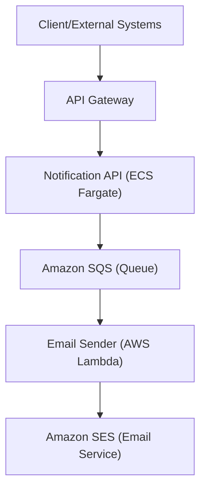
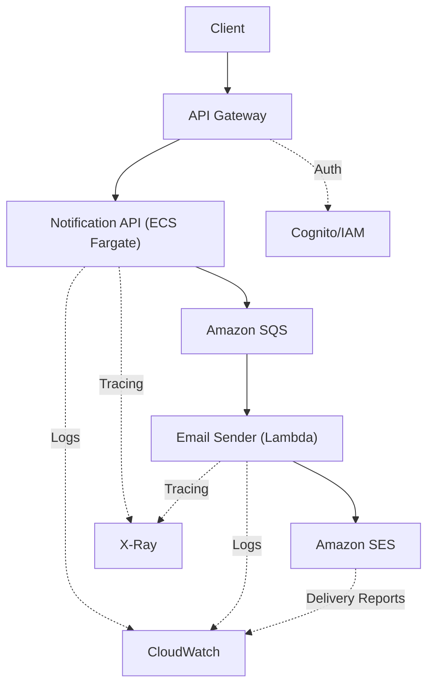

# Cloud Architecture Design for Notification System

## Overview

This document details the proposed AWS cloud architecture for the Notification System, focusing on scalability, reliability, security, observability, and cost-effectiveness. The architecture leverages managed AWS services to ensure a robust, maintainable, and production-ready solution.

---

## High-Level Architecture

The system consists of two main microservices:
- **Notification API**: Receives and validates notification requests, queues them for processing.
- **Email Sender**: Processes queued messages and sends emails.

These services are decoupled using Amazon SQS for asynchronous communication.

### High-Level Architecture Diagram (Mermaid)



---

## Component Breakdown & AWS Service Selection

### 1. API Layer
- **Amazon API Gateway**
  - Exposes RESTful endpoints for clients to submit notification requests.
  - Handles request validation, throttling, and authentication (e.g., via Cognito or IAM).

### 2. Notification API Microservice
- **AWS ECS Fargate (or AWS Lambda)**
  - Runs the Node.js/NestJS Notification API as a containerized service.
  - Scales automatically based on load.
  - Alternative: AWS Lambda for fully serverless, but ECS Fargate is chosen for more control and easier containerization.
- **Amazon SQS**
  - Decouples the API from the email processing logic.
  - Ensures reliable, at-least-once delivery of notification requests.

### 3. Email Sender Microservice
- **AWS Lambda**
  - Triggered by new messages in the SQS queue.
  - Processes each message and sends emails using Amazon SES.
  - Scales automatically with the number of messages.
- **Amazon SES (Simple Email Service)**
  - Sends transactional emails reliably and at scale.

### 4. Observability & Monitoring
- **Amazon CloudWatch**
  - Collects logs and metrics from API Gateway, ECS, Lambda, and SES.
  - Enables alerting for failures, high latency, or undelivered messages.
- **AWS X-Ray**
  - Provides distributed tracing for debugging and performance analysis.

### 5. Security
- **IAM Roles & Policies**
  - Principle of least privilege for all services.
  - Separate roles for ECS tasks, Lambda functions, and API Gateway.
- **VPC & Networking**
  - Deploy ECS and Lambda in private subnets.
  - Use VPC endpoints for SQS and SES to avoid public internet exposure.
- **Secrets Management**
  - Use AWS Secrets Manager or SSM Parameter Store for sensitive configuration.
- **API Authentication**
  - Use Cognito User Pools or IAM for securing API Gateway endpoints.

### 6. Cost-Effectiveness
- **Serverless and managed services** reduce operational overhead and scale with demand.
- **SQS and Lambda** are pay-per-use, minimizing idle costs.
- **ECS Fargate** only incurs costs for running containers.

---

## Detailed Data Flow

1. **Client** sends a notification request to the **API Gateway**.
2. **API Gateway** authenticates and forwards the request to the **Notification API** (ECS Fargate).
3. **Notification API** validates the request and enqueues a message in **Amazon SQS**.
4. **AWS Lambda** (Email Sender) is triggered by new SQS messages, processes them, and sends emails via **Amazon SES**.
5. All logs and metrics are sent to **CloudWatch** for monitoring and alerting.

### Data Flow ASCII Diagram

```
Client
  |
  v
API Gateway
  |
  v
Notification API (ECS Fargate)
  |
  v
Amazon SQS
  |
  v
Email Sender (Lambda)
  |
  v
Amazon SES
```

---

## Best Practices Addressed

### Scalability
- **API Gateway, SQS, Lambda, and ECS Fargate** all scale automatically with demand.
- Decoupling via SQS allows each component to scale independently.

### High Availability
- All services are managed and deployed across multiple Availability Zones.
- SQS and Lambda are inherently highly available.
- ECS Fargate tasks can be distributed across AZs.

### Security
- IAM roles restrict access to only necessary resources.
- Private subnets and VPC endpoints minimize public exposure.
- API authentication and secrets management are enforced.

### Observability
- CloudWatch provides centralized logging, metrics, and alerting.
- X-Ray enables distributed tracing for debugging.

### Cost-Effectiveness
- Serverless and managed services reduce operational and idle costs.
- Pay-per-use pricing for Lambda, SQS, and SES.

---

## Optional Enhancements

- **Dead Letter Queue (DLQ):** Attach a DLQ to SQS and Lambda for failed messages.
- **Retry Logic:** Implement exponential backoff for failed email sends.
- **CI/CD Pipeline:** Use AWS CodePipeline or GitHub Actions for automated deployments.
- **Disaster Recovery:** Regular backups and multi-region deployment for critical components.

---

## Summary Table

| Component           | AWS Service        | Purpose                                  |
|---------------------|--------------------|------------------------------------------|
| API Layer           | API Gateway        | Expose REST API, auth, throttling        |
| Notification API    | ECS Fargate        | Validate & queue notifications           |
| Queue               | Amazon SQS         | Decouple & buffer notification requests  |
| Email Processor     | AWS Lambda         | Process queue, send emails               |
| Email Delivery      | Amazon SES         | Transactional email sending              |
| Monitoring/Logging  | CloudWatch, X-Ray  | Observability, alerting, tracing         |
| Security            | IAM, VPC, Secrets  | Access control, network isolation        |

---

## Architecture Diagram (Mermaid)



---

This architecture ensures the notification system is scalable, reliable, secure, observable, and cost-effective, leveraging the best of AWS managed services. 

---

## Justification

This section explains the rationale behind each major design choice and how it addresses the project’s requirements:

### 1. API Gateway
- **Why:** Provides a managed, scalable, and secure entry point for all client requests.
- **Meets Requirements:** Handles authentication, throttling, and request validation, ensuring security and reliability at the edge.

### 2. ECS Fargate for Notification API
- **Why:** Offers container orchestration without server management, supporting complex Node.js/NestJS workloads.
- **Meets Requirements:** Enables horizontal scaling, high availability, and easy integration with CI/CD pipelines. Fargate’s pay-as-you-go model is cost-effective for variable workloads.

### 3. Amazon SQS
- **Why:** Decouples the API from the email processing logic, providing reliable message delivery and buffering.
- **Meets Requirements:** Ensures scalability (buffering spikes), reliability (at-least-once delivery), and cost-effectiveness (pay-per-use).

### 4. AWS Lambda for Email Sender
- **Why:** Serverless compute that automatically scales with the number of messages in the queue.
- **Meets Requirements:** Reduces operational overhead, scales instantly, and is cost-effective for event-driven workloads.

### 5. Amazon SES
- **Why:** Managed, scalable, and reliable email delivery service.
- **Meets Requirements:** Ensures high deliverability, security, and compliance for transactional emails.

### 6. CloudWatch & X-Ray
- **Why:** Native AWS tools for logging, monitoring, and distributed tracing.
- **Meets Requirements:** Provide observability, real-time alerting, and deep insights for troubleshooting and performance optimization.

### 7. Security (IAM, VPC, Secrets Manager)
- **Why:** Enforces least privilege, network isolation, and secure secrets management.
- **Meets Requirements:** Protects sensitive data, restricts access, and ensures compliance with security best practices.

### 8. Cost-Effectiveness
- **Why:** Serverless and managed services minimize idle costs and operational burden.
- **Meets Requirements:** Pay-per-use pricing and managed scaling keep costs low while supporting growth.

---

This architecture was chosen to maximize scalability, reliability, security, observability, and cost-effectiveness, leveraging AWS managed services and best practices throughout the system. 