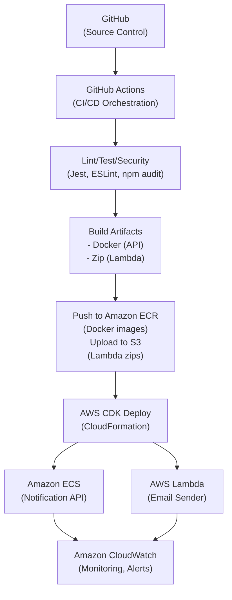

# Deployment Strategy for Notification System

## Overview

This document describes the deployment strategy for the Notification System, focusing on scalability, reliability, security, and operational excellence. The approach leverages AWS managed services, modern DevOps practices, and infrastructure-as-code for robust, repeatable, and secure deployments.

---

## CI/CD Pipeline

A robust CI/CD pipeline ensures rapid, reliable, and secure delivery of features and fixes. The pipeline automates building, testing, and deploying both application code and infrastructure.

### Pipeline Flow

1. **Source Control Integration**
   - All code is managed in GitHub with protected branches and pull request reviews.
2. **Automated Build & Test**
   - On every push or PR, the pipeline runs linting, unit tests, E2E tests, and security scans.
3. **Artifact Build & Storage**
   - Docker images are built and pushed to Amazon ECR.
   - Lambda packages are built and stored as artifacts.
4. **Infrastructure as Code**
   - AWS CDK defines and updates all infrastructure, ensuring consistency and repeatability.
5. **Automated Deployment**
   - Deployments to dev/staging/prod are triggered automatically or via manual approval steps.
   - Blue/Green or Canary deployments are used for zero-downtime releases.
6. **Post-Deployment Validation**
   - Automated smoke tests and health checks ensure successful deployment.
7. **Monitoring & Rollback**
   - CloudWatch monitors deployments; failures trigger automated rollbacks to the last stable version.

#### CI/CD Pipeline Diagram (Mermaid)



**Stage Explanations:**
- **GitHub:** All code (app, infra, tests) is versioned and reviewed here.
- **GitHub Actions:** Orchestrates the CI/CD workflow, running on code changes.
- **Lint/Test/Security:** Uses Jest for tests, ESLint for linting, and npm audit for security checks.
- **Build Artifacts:** Docker is used to build the Notification API image; Lambda code is zipped for deployment.
- **Push to Amazon ECR/S3:** Docker images are pushed to Amazon ECR; Lambda zips are uploaded to S3 for deployment.
- **AWS CDK Deploy:** CDK synthesizes and deploys CloudFormation stacks, provisioning or updating AWS resources.
- **Amazon ECS/AWS Lambda:** ECS runs the Notification API container; Lambda runs the email sender function.
- **Amazon CloudWatch:** Collects logs, metrics, and sends alerts for all deployed services.

---

## Deployment Strategies

### Zero-Downtime Deployments
- **Blue/Green Deployments:** Deploy new version alongside the old one, switch traffic after health checks pass, and enable instant rollback.
- **Canary Deployments:** Gradually shift a small percentage of traffic to the new version, monitor for errors, then complete rollout.
- **Immutable Infrastructure:** Deploy new containers or Lambda versions rather than updating in place, ensuring consistency and easy rollback.
- **Health Checks & Automated Rollbacks:** ECS and Lambda have health checks; failed deployments are automatically rolled back.

#### Zero-Downtime Deployment Diagram (ASCII)

```
+-------------------+         +-------------------+
|   Old Service     |         |   New Service     |
|   (ECS/Lambda)    |         |   (ECS/Lambda)    |
+-------------------+         +-------------------+
         |                             |
         +-----------+   +-------------+
                     |   |
                 Traffic Switch (DNS/Load Balancer)
                     |
                     v
             +-----------+
             |   Users   |
             +-----------+
```

---

## Scalability, Reliability, and Security

- **Scalability:**
  - ECS Fargate and Lambda scale automatically based on load.
  - SQS buffers requests, decoupling producers and consumers for independent scaling.
  - API Gateway scales horizontally to handle high request volumes.
  - Infrastructure-as-Code (CDK) allows for easy scaling adjustments and repeatable environments.

- **Reliability:**
  - Multi-AZ deployments for ECS, Lambda, and SQS.
  - Health checks and auto-restart on failure.
  - Automated rollbacks and monitoring with CloudWatch.
  - Dead Letter Queues (DLQ) for failed messages.

- **Security:**
  - IAM roles and policies with least privilege.
  - Secrets managed in AWS Secrets Manager or SSM Parameter Store.
  - ECS and Lambda run in private subnets, inaccessible from the public internet.
  - API Gateway uses Cognito or IAM for secure access.
  - CI/CD pipeline secrets are encrypted; all deployment actions are logged.

---

## Disaster Recovery

- **Automated Backups:** Use AWS Backup or scheduled Lambda functions to back up critical data and configurations.
- **Infrastructure as Code:** All infrastructure is defined in CDK, enabling rapid redeployment in a new region if needed.
- **Multi-AZ Deployments:** ECS, Lambda, and SQS are deployed across multiple Availability Zones for high availability.
- **Versioned Artifacts:** Docker images and Lambda packages are versioned and stored in ECR/S3 for easy rollback and redeployment.
- **Monitoring & Alerting:** CloudWatch alarms notify the team of failures or outages, enabling rapid response.
- **Runbooks & Documentation:** Maintain clear runbooks for disaster scenarios and recovery procedures.

---

## Best Practices Summary

- **Immutable Infrastructure:** Deploy new containers/Lambda versions for every release.
- **Automated Testing:** Prevent regressions and vulnerabilities from reaching production.
- **Infrastructure as Code:** All resources are defined and versioned in CDK for repeatability.
- **Least Privilege:** All AWS resources and pipeline steps use minimal required permissions.
- **Rollback & Recovery:** Automated rollbacks and DLQs ensure rapid recovery from failures.

---

This deployment strategy ensures the Notification System is robust, scalable, secure, and able to recover quickly from failures, while supporting rapid and safe delivery of new features. 