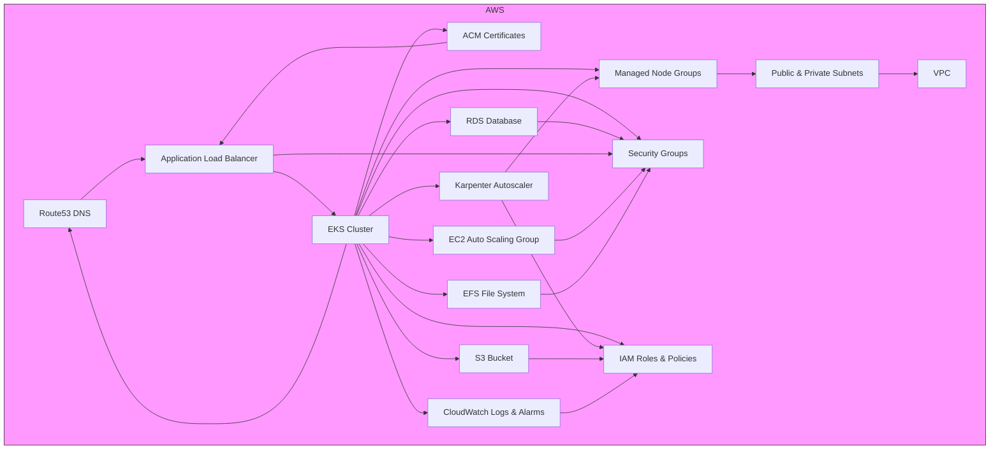

# Project Architecture

This diagram illustrates how the main AWS infrastructure components in this project interact and work together:

**Legend:**
- All resources are provisioned and managed by Terraform modules in this project.
- Arrows indicate primary relationships or dependencies (e.g., EKS nodes run in subnets, ALB routes to EKS, etc.).
- Karpenter dynamically manages node scaling for EKS. 