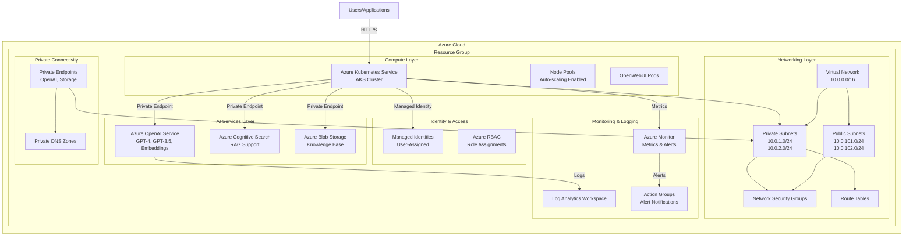
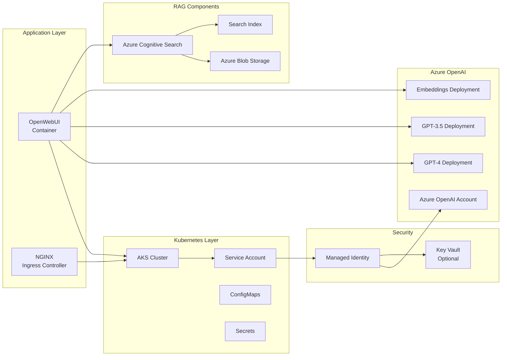
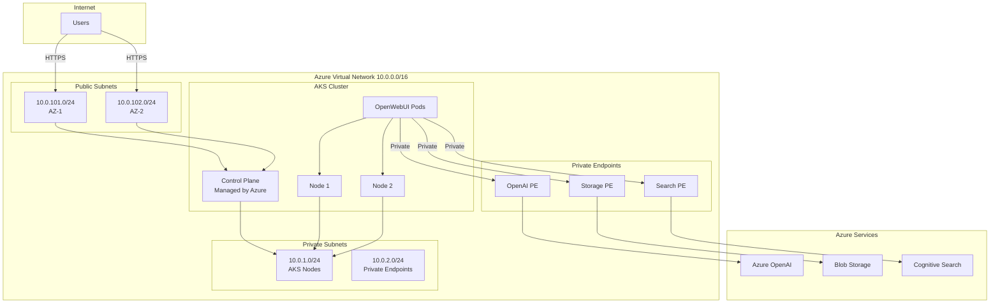
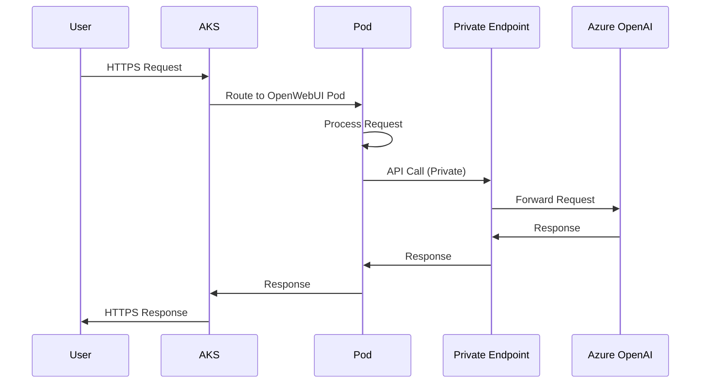
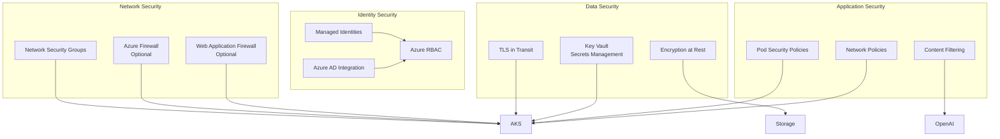
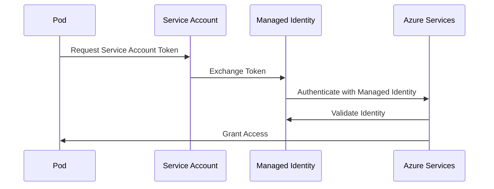
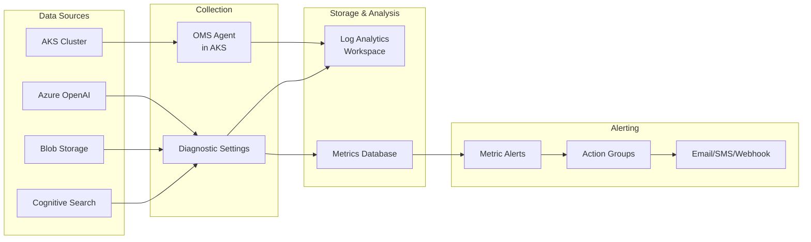

# Azure Infrastructure Architecture Documentation

## Overview

This document provides comprehensive documentation for the Azure cloud infrastructure that replaces the original AWS EKS setup. The infrastructure is designed to support OpenWebUI with Azure OpenAI Service integration, providing a scalable and secure platform for LLM-based applications.

## Table of Contents

1. [Architecture Overview](#architecture-overview)
2. [Component Breakdown](#component-breakdown)
3. [Resource Mapping (AWS to Azure)](#resource-mapping)
4. [Network Architecture](#network-architecture)
5. [Security Architecture](#security-architecture)
6. [Monitoring and Logging](#monitoring-and-logging)
7. [Deployment Guide](#deployment-guide)
8. [Troubleshooting](#troubleshooting)

---

## Architecture Overview

### High-Level Architecture Diagram



### Detailed Component Architecture



---

## Component Breakdown

### 1. Virtual Network (VNet)

**Purpose**: Provides network isolation and segmentation for all Azure resources.

**Components**:
- **Virtual Network**: Main network container (10.0.0.0/16)
- **Public Subnets**: For public-facing resources (10.0.101.0/24, 10.0.102.0/24)
- **Private Subnets**: For AKS nodes and private endpoints (10.0.1.0/24, 10.0.2.0/24)
- **Network Security Groups (NSG)**: Firewall rules for network traffic
- **Route Tables**: Custom routing configuration

**Key Features**:
- Network isolation between public and private subnets
- Support for private endpoints
- Integration with Azure services

### 2. Azure Kubernetes Service (AKS)

**Purpose**: Managed Kubernetes cluster for running containerized applications.

**Components**:
- **Control Plane**: Managed by Azure (no management overhead)
- **Node Pools**: Worker nodes running Kubernetes workloads
- **Cluster Autoscaler**: Automatically scales nodes based on demand
- **Azure CNI**: Network plugin for pod networking
- **Azure Policy**: Network policies for pod-to-pod communication

**Key Features**:
- Auto-scaling (min: 1, max: 10 nodes)
- Managed identity integration
- Azure Monitor integration
- RBAC enabled
- Azure AD integration (optional)

### 3. Azure OpenAI Service

**Purpose**: Provides access to OpenAI models (GPT-4, GPT-3.5, Embeddings) with enterprise-grade security.

**Components**:
- **Cognitive Services Account**: OpenAI service instance
- **Model Deployments**: Individual model deployments (GPT-4, GPT-3.5, Embeddings)
- **Private Endpoints**: Secure connectivity from VNet
- **Content Filtering**: Built-in content moderation

**Key Features**:
- Multiple model deployments
- Private endpoint support
- Managed identity authentication
- Content filtering
- Regional availability

### 4. Azure Cognitive Search

**Purpose**: Provides RAG (Retrieval-Augmented Generation) capabilities for knowledge base.

**Components**:
- **Search Service**: Full-text search engine
- **Indexes**: Searchable data structures
- **Data Sources**: Connections to Azure Blob Storage
- **Skills**: AI-powered enrichment

**Key Features**:
- Vector search support
- Integration with Azure OpenAI embeddings
- Blob storage integration
- Semantic search capabilities

### 5. Azure Blob Storage

**Purpose**: Stores knowledge base documents and data for RAG.

**Components**:
- **Storage Account**: Container for blobs
- **Containers**: Logical grouping of blobs
- **Versioning**: Document version control
- **Access Policies**: Secure access control

**Key Features**:
- Versioning enabled
- Private endpoint support
- Managed identity access
- Cost-effective storage

### 6. Managed Identities

**Purpose**: Provides secure, passwordless authentication to Azure services.

**Components**:
- **User-Assigned Managed Identity**: For AKS and OpenWebUI
- **System-Assigned Managed Identity**: For Azure services
- **Role Assignments**: RBAC permissions

**Key Features**:
- No secrets to manage
- Automatic credential rotation
- Integration with Azure services
- Kubernetes service account integration

### 7. Azure Monitor & Log Analytics

**Purpose**: Centralized monitoring, logging, and alerting.

**Components**:
- **Log Analytics Workspace**: Centralized log storage
- **Azure Monitor**: Metrics and performance monitoring
- **Action Groups**: Alert notification targets
- **Metric Alerts**: Automated alerting rules
- **Diagnostic Settings**: Resource-level logging

**Key Features**:
- 30-day log retention (configurable)
- Custom metrics and alerts
- Integration with Azure services
- Query capabilities with KQL

### 8. Private Endpoints

**Purpose**: Secure, private connectivity to Azure services from VNet.

**Components**:
- **Private Endpoints**: Network interfaces in VNet
- **Private DNS Zones**: DNS resolution for private endpoints
- **Private Link**: Secure connection to Azure services

**Key Features**:
- Traffic stays on Azure backbone
- No public internet exposure
- DNS integration
- Network isolation

---

## Resource Mapping (AWS to Azure)

| AWS Service | Azure Equivalent | Purpose |
|------------|------------------|---------|
| **VPC** | **Virtual Network (VNet)** | Network isolation and segmentation |
| **Subnets** | **Subnets** | Network segments within VNet |
| **Security Groups** | **Network Security Groups (NSG)** | Firewall rules for network traffic |
| **EKS** | **Azure Kubernetes Service (AKS)** | Managed Kubernetes cluster |
| **Karpenter** | **Cluster Autoscaler** | Automatic node scaling |
| **Bedrock** | **Azure OpenAI Service** | LLM model access |
| **S3** | **Azure Blob Storage** | Object storage |
| **CloudWatch** | **Azure Monitor + Log Analytics** | Monitoring and logging |
| **IAM Roles** | **Managed Identities** | Service authentication |
| **IAM Policies** | **Azure RBAC** | Access control |
| **Route53** | **Azure DNS** | DNS management |
| **RDS** | **Azure Database (PostgreSQL/MySQL)** | Managed databases |
| **EFS** | **Azure Files** | Shared file storage |
| **ALB** | **Application Gateway** | Load balancing |
| **ACM** | **Key Vault Certificates** | SSL/TLS certificates |
| **VPC Endpoints** | **Private Endpoints** | Private service connectivity |

---

## Network Architecture

### Network Topology



### Network Flow



---

## Security Architecture

### Security Layers



### Authentication Flow



---

## Monitoring and Logging

### Monitoring Architecture



### Key Metrics Monitored

1. **AKS Metrics**:
   - Node CPU/Memory usage
   - Pod count and status
   - Cluster health
   - Network throughput

2. **Azure OpenAI Metrics**:
   - API call count
   - Token usage
   - Error rate
   - Response latency

3. **Storage Metrics**:
   - Storage capacity
   - Read/write operations
   - Data transfer

4. **Search Metrics**:
   - Query count
   - Index size
   - Search latency

---

## Deployment Guide

### Prerequisites

1. **Azure Subscription**: Active Azure subscription with appropriate permissions
2. **Azure CLI**: Installed and configured
3. **Terraform**: Version >= 1.0
4. **kubectl**: Kubernetes command-line tool
5. **Helm**: For Kubernetes package management (optional)

### Step 1: Configure Azure Authentication

```bash
# Login to Azure
az login

# Set subscription
az account set --subscription "<subscription-id>"

# Create service principal (optional, for CI/CD)
az ad sp create-for-rbac --role="Contributor" --scopes="/subscriptions/<subscription-id>"
```

### Step 2: Configure Terraform Variables

Create `terraform.tfvars`:

```hcl
subscription_id = "your-subscription-id"
tenant_id       = "your-tenant-id"
location        = "eastus"
cluster_name    = "my-aks-cluster"
vpc_name        = "aks-vnet"
vpc_cidr        = ["10.0.0.0/16"]
private_subnets = ["10.0.1.0/24", "10.0.2.0/24"]
public_subnets  = ["10.0.101.0/24", "10.0.102.0/24"]
cluster_version = "1.27"
```

### Step 3: Initialize and Apply Terraform

```bash
# Initialize Terraform
terraform init

# Plan deployment
terraform plan

# Apply infrastructure
terraform apply
```

### Step 4: Configure kubectl

```bash
# Get AKS credentials
az aks get-credentials --resource-group <resource-group-name> --name <cluster-name>

# Verify connection
kubectl get nodes
```

### Step 5: Deploy OpenWebUI

The Terraform configuration includes a null resource that automatically deploys OpenWebUI. Alternatively, you can deploy manually:

```bash
# Apply OpenWebUI deployment
kubectl apply -f modules/openai/openwebui-deployment.yaml
```

### Step 6: Verify Deployment

```bash
# Check pods
kubectl get pods -n default

# Check services
kubectl get services

# Check ingress
kubectl get ingress
```

---

## Troubleshooting

### Common Issues

#### 1. AKS Cluster Not Accessible

**Symptoms**: Cannot connect to AKS cluster

**Solutions**:
- Verify network security group rules
- Check if private endpoint is configured correctly
- Verify kubectl credentials: `az aks get-credentials --resource-group <rg> --name <cluster>`

#### 2. OpenAI API Authentication Failures

**Symptoms**: 401/403 errors when calling OpenAI API

**Solutions**:
- Verify managed identity role assignments
- Check if managed identity is attached to AKS
- Verify OpenAI endpoint and API key configuration

#### 3. Private Endpoint Connectivity Issues

**Symptoms**: Cannot reach Azure services via private endpoints

**Solutions**:
- Verify private DNS zone configuration
- Check VNet link for private DNS zone
- Verify subnet has private endpoint network policies enabled

#### 4. Pod Scheduling Issues

**Symptoms**: Pods stuck in Pending state

**Solutions**:
- Check node capacity: `kubectl describe nodes`
- Verify node pool autoscaling is enabled
- Check resource requests/limits in pod specifications

#### 5. High Latency

**Symptoms**: Slow API responses

**Solutions**:
- Check node resource utilization
- Verify private endpoint location matches service location
- Review Azure Monitor metrics for bottlenecks

### Useful Commands

```bash
# Get AKS cluster details
az aks show --resource-group <rg> --name <cluster>

# Get node pool information
az aks nodepool list --resource-group <rg> --cluster-name <cluster>

# View logs from Log Analytics
az monitor log-analytics query --workspace <workspace-id> --analytics-query "AzureActivity | limit 10"

# Check managed identity assignments
az role assignment list --assignee <principal-id>

# Test private endpoint connectivity
nslookup <service-endpoint>
```

---

## Cost Optimization

### Recommendations

1. **Node Pool Sizing**: Use appropriate VM sizes for workloads
2. **Autoscaling**: Enable cluster autoscaler to scale down during low usage
3. **Reserved Instances**: Consider reserved capacity for predictable workloads
4. **Storage Tiering**: Use appropriate storage tiers for Blob Storage
5. **Log Retention**: Adjust log retention periods based on compliance needs
6. **Private Endpoints**: Use private endpoints only when required for security

### Estimated Monthly Costs (East US)

- **AKS Cluster**: ~$73/month (control plane) + node costs
- **Standard_D2s_v3 Nodes (2 nodes)**: ~$120/month
- **Azure OpenAI**: Pay-per-use (varies by model and usage)
- **Cognitive Search (Standard)**: ~$250/month
- **Blob Storage**: ~$0.02/GB/month
- **Log Analytics**: ~$2.30/GB ingested
- **Private Endpoints**: ~$7.30/month per endpoint

**Total Estimated**: ~$450-600/month (excluding OpenAI usage)

---

## Best Practices

1. **Security**:
   - Use managed identities instead of service principals
   - Enable private endpoints for sensitive services
   - Implement network security groups with least privilege
   - Enable Azure AD integration for AKS

2. **Reliability**:
   - Deploy across multiple availability zones
   - Use cluster autoscaler for high availability
   - Implement health checks and readiness probes
   - Set up monitoring and alerting

3. **Performance**:
   - Use appropriate VM sizes for workloads
   - Enable cluster autoscaler
   - Optimize pod resource requests/limits
   - Use Azure CNI for better network performance

4. **Cost Management**:
   - Right-size node pools
   - Use spot instances for non-critical workloads (optional)
   - Monitor and optimize storage usage
   - Review and adjust log retention policies

---

## Additional Resources

- [Azure Kubernetes Service Documentation](https://docs.microsoft.com/azure/aks/)
- [Azure OpenAI Service Documentation](https://learn.microsoft.com/azure/cognitive-services/openai/)
- [Azure Virtual Network Documentation](https://docs.microsoft.com/azure/virtual-network/)
- [Azure Monitor Documentation](https://docs.microsoft.com/azure/azure-monitor/)
- [Managed Identities Documentation](https://docs.microsoft.com/azure/active-directory/managed-identities-azure-resources/)

---

## Support

For issues or questions:
1. Check Azure Service Health
2. Review Azure Monitor logs
3. Consult Azure documentation
4. Contact Azure support (if applicable)

---

**Last Updated**: 2024
**Version**: 1.0

