# Azure Solution Architecture - Detailed Breakdown

## Executive Summary

This document provides a comprehensive breakdown of the Azure cloud infrastructure solution that replaces the AWS EKS architecture. The solution leverages Azure-native services to provide a scalable, secure, and cost-effective platform for running OpenWebUI with Azure OpenAI integration.

---

## Solution Architecture Overview

### Complete System Architecture

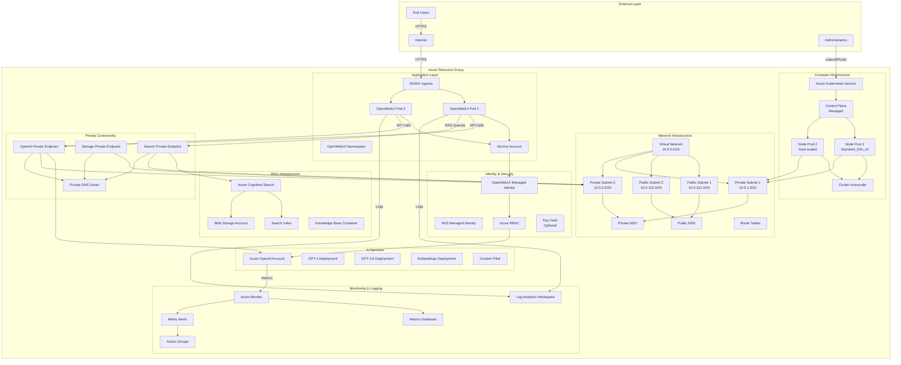

---

## Component Breakdown with Data Flow

### 1. Request Flow Architecture

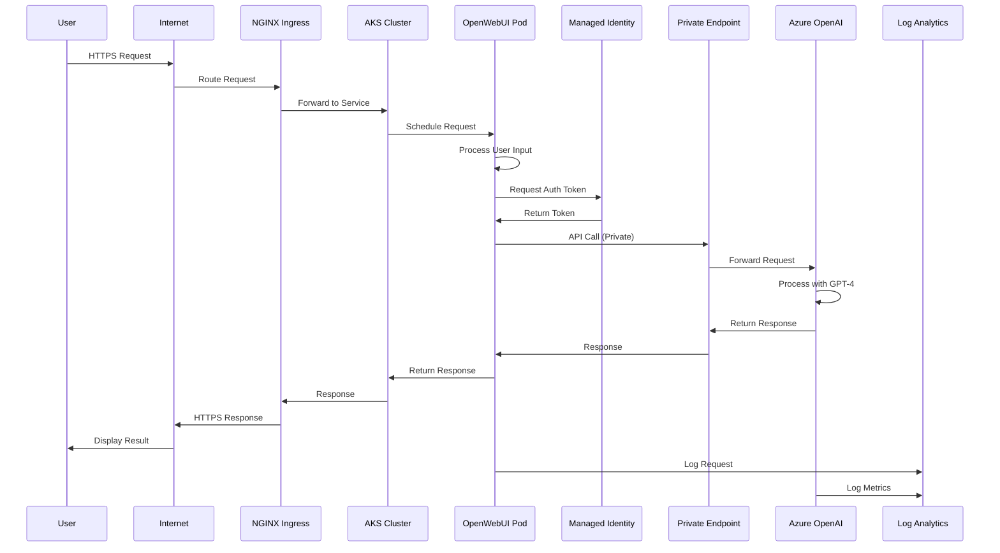

### 2. RAG (Retrieval-Augmented Generation) Flow

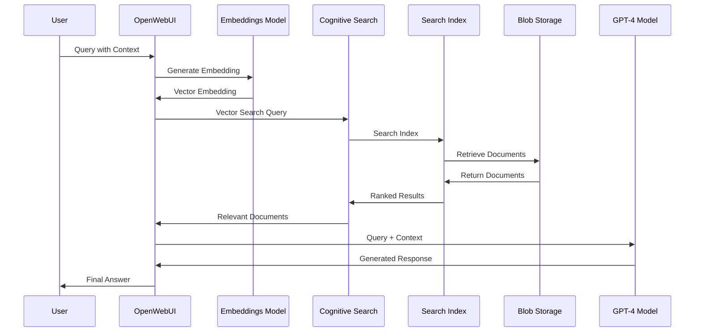

### 3. Authentication & Authorization Flow

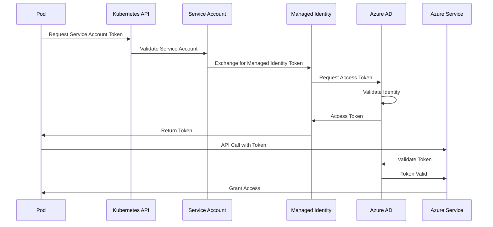

---

## Network Architecture Deep Dive

### Network Segmentation

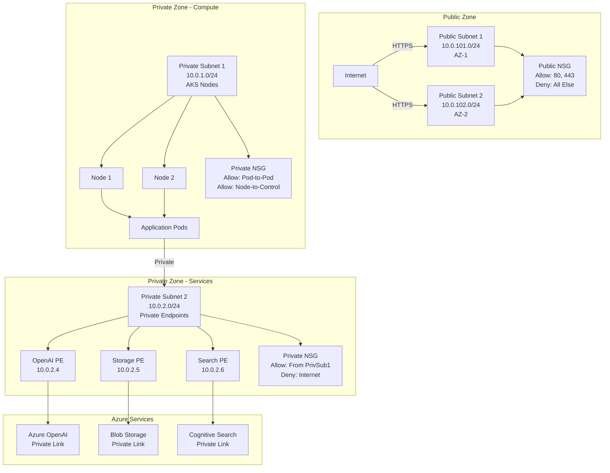

### DNS Resolution Flow

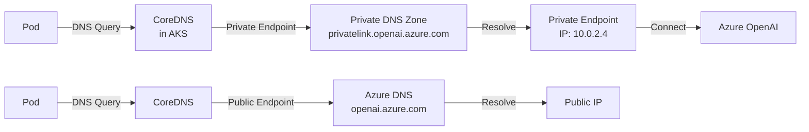

---

## Security Architecture

### Defense in Depth

```mermaid
graph TB
    subgraph "Layer 1: Network Security"
        WAF[Web Application Firewall<br/>Optional]
        NSG[Network Security Groups]
        Firewall[Azure Firewall<br/>Optional]
    end
    
    subgraph "Layer 2: Identity Security"
        AAD[Azure AD]
        MI[Managed Identities]
        RBAC[Role-Based Access Control]
        MFA[Multi-Factor Authentication]
    end
    
    subgraph "Layer 3: Application Security"
        PodSec[Pod Security Policies]
        NetPol[Network Policies]
        Secrets[Secrets Management]
        ContentFilter[Content Filtering]
    end
    
    subgraph "Layer 4: Data Security"
        Encryption[Encryption at Rest]
        TLS[TLS in Transit]
        KeyVault[Key Vault]
        Backup[Backup & Recovery]
    end
    
    subgraph "Layer 5: Monitoring & Compliance"
        Audit[Audit Logs]
        Monitor[Azure Monitor]
        Compliance[Compliance Policies]
        Alerts[Security Alerts]
    end
    
    WAF --> NSG
    NSG --> Firewall
    AAD --> MI
    MI --> RBAC
    RBAC --> MFA
    PodSec --> NetPol
    NetPol --> Secrets
    Secrets --> ContentFilter
    Encryption --> TLS
    TLS --> KeyVault
    KeyVault --> Backup
    Audit --> Monitor
    Monitor --> Compliance
    Compliance --> Alerts
```

### Security Posture

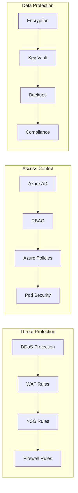

---

## Scalability Architecture

### Horizontal Scaling

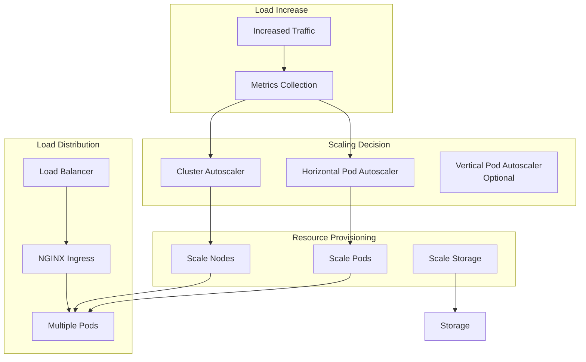

### Auto-Scaling Flow

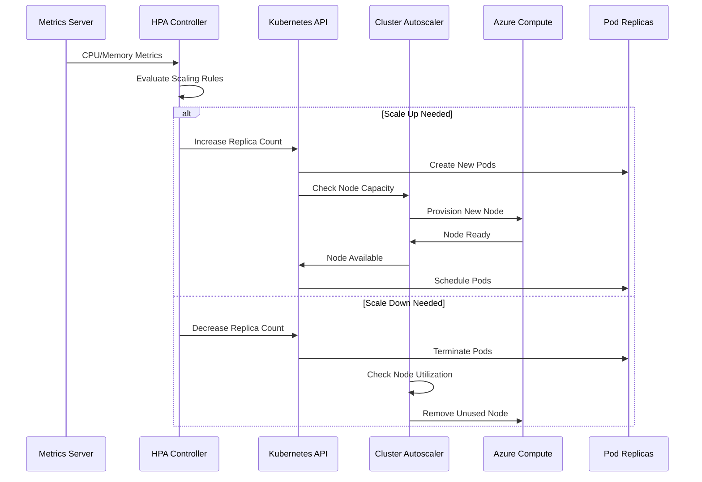

---

## Data Flow Architecture

### Complete Data Flow

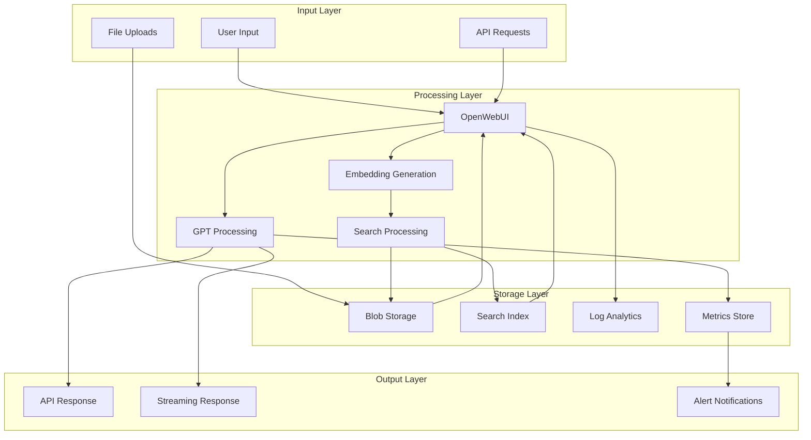

---

## Disaster Recovery & High Availability

### HA Architecture

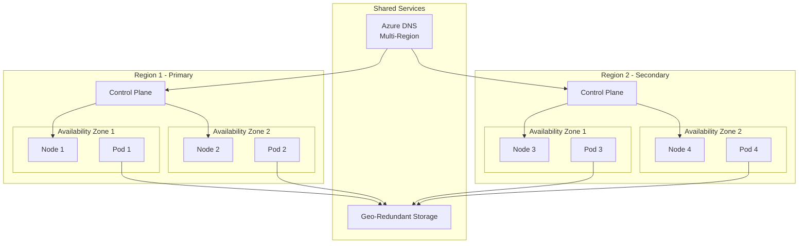

---

## Cost Architecture

### Cost Breakdown by Component

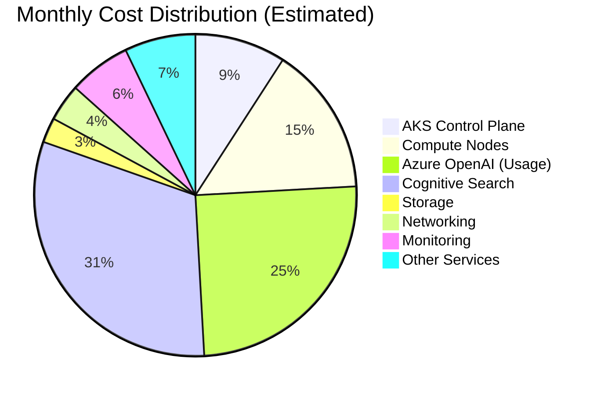

### Cost Optimization Strategies

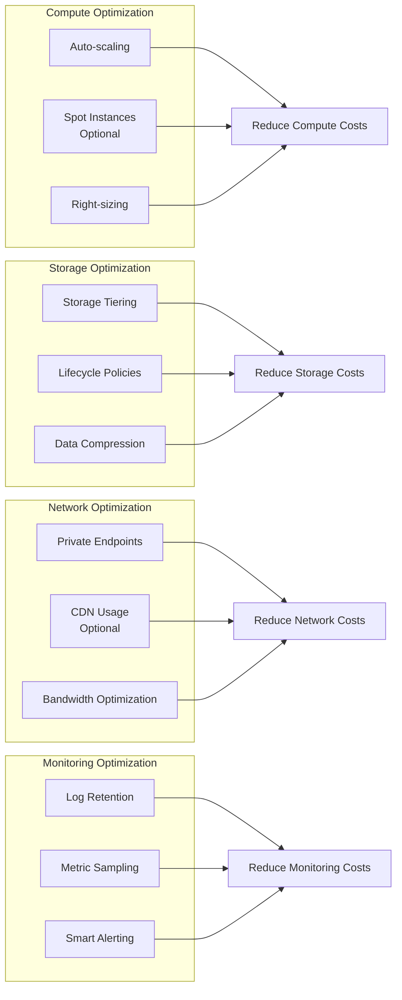

---

## Deployment Architecture

### Terraform Module Structure

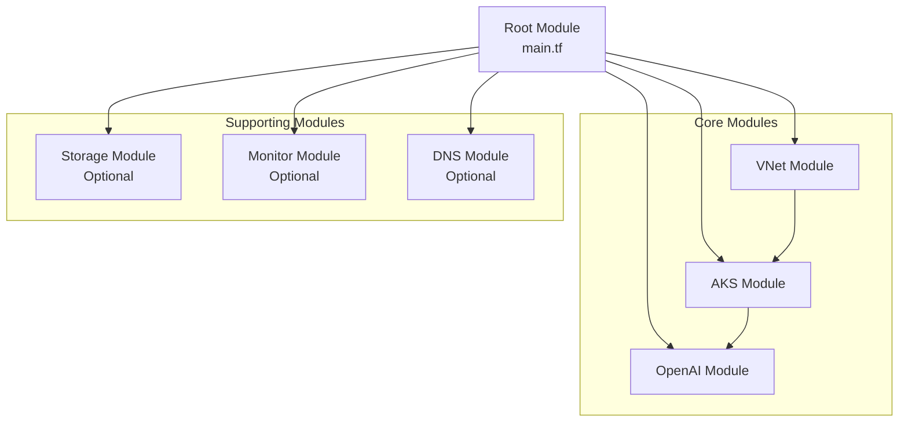

### Deployment Flow

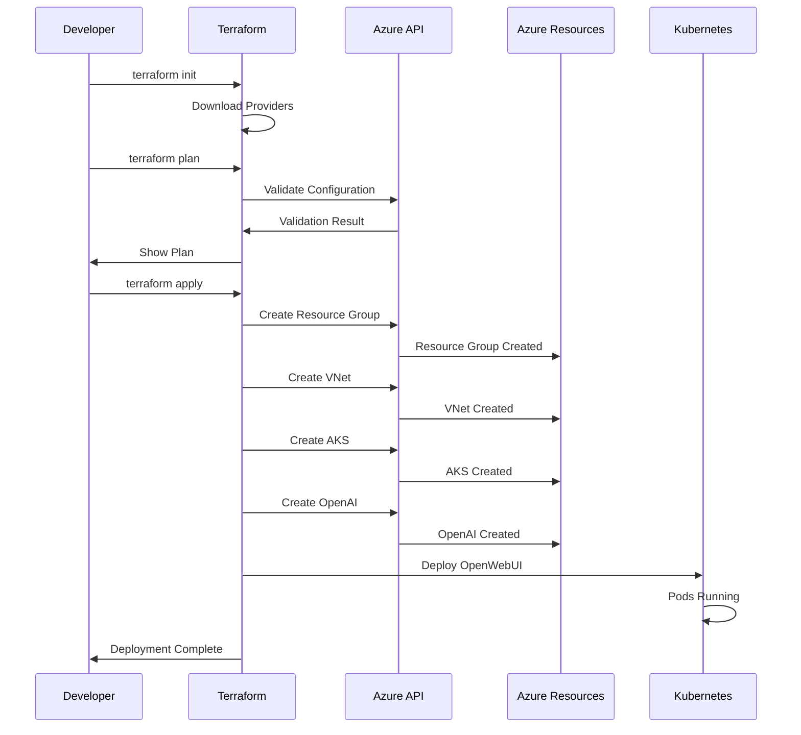

---

## Monitoring & Observability

### Observability Stack

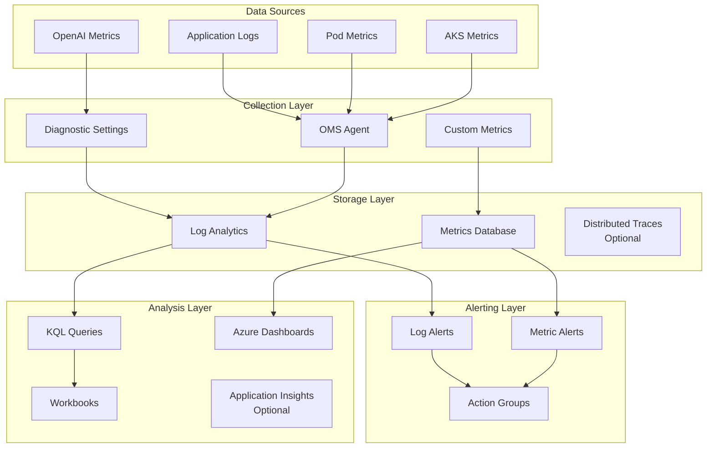

---

## Summary

This Azure solution architecture provides:

1. **Scalability**: Auto-scaling AKS cluster with horizontal pod autoscaling
2. **Security**: Multi-layer security with managed identities, private endpoints, and network isolation
3. **Reliability**: High availability across availability zones with managed services
4. **Observability**: Comprehensive monitoring and logging with Azure Monitor and Log Analytics
5. **Cost Efficiency**: Pay-as-you-go model with optimization opportunities
6. **Compliance**: Built-in compliance features and audit logging

The architecture is designed to be production-ready, secure, and scalable for enterprise workloads.

---

**Document Version**: 1.0  
**Last Updated**: 2024  
**Maintained By**: Platform Team

