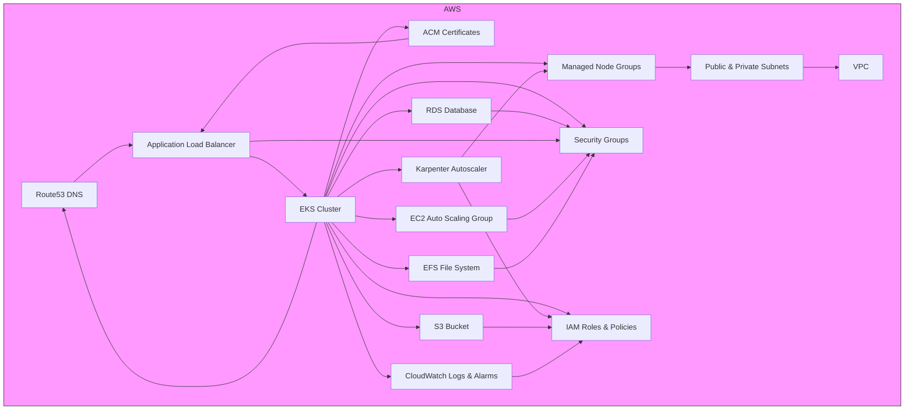

# Terraform AWS EKS Cluster Project

## Project Structure

```
terraform/
├── environments/
│   └── dev/
│       └── terraform.tfvars
├── modules/
│   ├── eks/
│   │   ├── main.tf
│   │   ├── outputs.tf
│   │   ├── variables.tf
│   │   └── README.md
│   ├── karpenter/
│   │   ├── main.tf
│   │   ├── outputs.tf
│   │   ├── variables.tf
│   │   ├── provisioner.yaml
│   │   └── README.md
│   ├── vpc/
│   │   ├── main.tf
│   │   ├── outputs.tf
│   │   ├── variables.tf
│   │   └── README.md
│   ├── rds/
│   │   ├── main.tf
│   │   ├── outputs.tf
│   │   ├── variables.tf
│   │   └── README.md
│   ├── s3/
│   │   ├── main.tf
│   │   ├── outputs.tf
│   │   ├── variables.tf
│   │   └── README.md
│   ├── iam/
│   │   ├── main.tf
│   │   ├── outputs.tf
│   │   ├── variables.tf
│   │   └── README.md
│   ├── alb/
│   │   ├── main.tf
│   │   ├── outputs.tf
│   │   ├── variables.tf
│   │   └── README.md
│   ├── cloudwatch/
│   │   ├── main.tf
│   │   ├── outputs.tf
│   │   ├── variables.tf
│   │   └── README.md
│   ├── efs/
│   │   ├── main.tf
│   │   ├── outputs.tf
│   │   ├── variables.tf
│   │   └── README.md
│   ├── route53/
│   │   ├── main.tf
│   │   ├── outputs.tf
│   │   ├── variables.tf
│   │   └── README.md
│   ├── acm/
│   │   ├── main.tf
│   │   ├── outputs.tf
│   │   ├── variables.tf
│   │   └── README.md
│   ├── autoscaling/
│   │   ├── main.tf
│   │   ├── outputs.tf
│   │   ├── variables.tf
│   │   └── README.md
│   ├── security_group/
│   │   ├── main.tf
│   │   ├── outputs.tf
│   │   ├── variables.tf
│   │   └── README.md
├── scripts/
│   └── nginx-daemonset.yaml
├── main.tf
├── outputs.tf
├── variables.tf
├── ARCHITECTURE.md
└── README.md
```

## Solution Architecture Diagram

The following diagram illustrates how the main AWS infrastructure components in this project interact and work together:



## Prerequisites

- AWS CLI installed and configured with the "exam3" profile (`aws configure --profile exam3`).
- Terraform &gt;= 1.0.0 installed.
- Appropriate IAM permissions for the "exam3" profile to create VPC, EKS, EC2, and IAM resources.

## Setup and Deployment

1. Navigate to the project root:

   ```bash
   cd terraform
   ```
2. Set the AWS profile to "exam3":

   ```bash
   export AWS_PROFILE=exam3
   ```

   Verify the profile:

   ```bash
   aws sts get-caller-identity --profile exam3
   ```
3. Initialize Terraform to download providers and modules:

   ```bash
   terraform init
   ```
4. Navigate to the development environment:

   ```bash
   cd environments/dev
   ```
5. Plan the deployment using the environment-specific variables:

   ```bash
   terraform plan -var-file=terraform.tfvars
   ```
6. Apply the configuration to deploy the EKS cluster:

   ```bash
   terraform apply -var-file=terraform.tfvars
   ```

   Confirm with `yes` when prompted. Deployment may take 10-15 minutes.
7. Save the kubeconfig for cluster access:

   ```bash
   terraform output -raw kubeconfig > kubeconfig.yaml
   ```
8. Test cluster access:

   ```bash
   export KUBECONFIG=$(pwd)/kubeconfig.yaml
   kubectl get nodes
   ```

## Automated NGINX Deployment

After the EKS cluster is successfully deployed, the workflow automatically deploys an NGINX DaemonSet to all EKS nodes using a Kubernetes manifest and a Terraform `null_resource`.

### How it Works
- The manifest is located at `scripts/nginx-daemonset.yaml`.
- A `null_resource` in `main.tf` runs a local `kubectl apply` command after EKS provisioning, using the generated `kubeconfig.yaml`.
- This ensures an NGINX pod is scheduled on every node in the cluster automatically, with no manual steps required.

### Requirements
- `kubectl` must be installed and available in your PATH on the machine running Terraform.
- The kubeconfig output from Terraform must be saved as `kubeconfig.yaml` in the `terraform/` directory (as described in the setup steps).

### NGINX DaemonSet Manifest
The manifest used is:

```yaml
apiVersion: apps/v1
kind: DaemonSet
metadata:
  name: nginx-daemonset
  labels:
    app: nginx
spec:
  selector:
    matchLabels:
      app: nginx
  template:
    metadata:
      labels:
        app: nginx
    spec:
      containers:
      - name: nginx
        image: nginx:latest
        ports:
        - containerPort: 80
```

### What Happens
- After `terraform apply`, Terraform will:
  1. Deploy the EKS cluster and nodes.
  2. Output the kubeconfig (see setup step 7).
  3. Automatically apply the NGINX DaemonSet manifest to the cluster.
- You can verify the deployment with:

  ```bash
  export KUBECONFIG=$(pwd)/kubeconfig.yaml
  kubectl get daemonset nginx-daemonset -A
  kubectl get pods -A
  ```

## Karpenter Integration (Best Practice)

Karpenter is automatically installed and configured as a node autoscaler for your EKS cluster using Terraform best practices.

### How it Works
- Terraform provisions all required IAM roles and policies for Karpenter using IRSA (IAM Roles for Service Accounts).
- The Karpenter controller is installed via the official Helm chart after EKS is ready.
- A sample Karpenter Provisioner manifest is provided in `modules/karpenter/provisioner.yaml` (apply with `kubectl` or the Kubernetes provider).

### Requirements
- `kubectl` and `helm` must be installed and available in your PATH.
- The EKS OIDC provider must be enabled (handled automatically by the EKS module).

### Customization
- You can edit the `provisioner.yaml` to control which instance types, zones, and other node properties Karpenter manages.
- The default instance profile and Helm chart version can be adjusted in the Karpenter module block in `main.tf`.

### Verification
After `terraform apply`, verify Karpenter is running and ready to scale nodes:

```bash
export KUBECONFIG=$(pwd)/kubeconfig.yaml
kubectl get pods -n karpenter
kubectl get provisioners
```

To trigger autoscaling, deploy a workload that exceeds current node capacity. Karpenter will provision new nodes as needed.

For more details, see the [Karpenter documentation](https://karpenter.sh/docs/).

## Testing

- Verify cluster endpoint:

  ```bash
  kubectl cluster-info
  ```
- Confirm 2 t3.medium nodes are running:

  ```bash
  kubectl get nodes
  ```
- Check VPC and subnets:

  ```bash
  aws ec2 describe-vpcs --profile exam3
  ```

## Cleanup

To destroy all resources created by this project and avoid ongoing AWS costs, follow these steps:

1. Navigate to the `environments/dev` directory:

   ```bash
   cd environments/dev
   ```

2. Ensure the "exam3" AWS profile is set:

   ```bash
   export AWS_PROFILE=exam3
   ```

   Verify the profile:

   ```bash
   aws sts get-caller-identity --profile exam3
   ```

3. Run the destroy command:

   ```bash
   terraform destroy -var-file=terraform.tfvars
   ```

   - Confirm with `yes` when prompted.
   - This will delete all resources (EKS cluster, VPC, subnets, IAM roles, etc.) created by the Terraform configuration.
   - The process may take 10-15 minutes due to EKS cluster deletion.

4. Verify resource deletion:

   ```bash
   aws eks describe-cluster --name dev-eks-cluster --profile exam3
   aws ec2 describe-vpcs --profile exam3
   ```

   - The EKS cluster should return a "not found" error.
   - No VPCs with the tag `kubernetes.io/cluster/dev-eks-cluster` should remain.

5. (Optional) Remove the Terraform state files to clean up the local environment:

   ```bash
   rm terraform.tfstate terraform.tfstate.backup
   ```

   **Warning**: Only remove state files if you are certain no further management of these resources is needed, as this prevents Terraform from tracking previously created resources.

## Troubleshooting

- **Sensitive Output Error**: If you encounter an error about sensitive values in `kubeconfig`, add `sensitive = true` to the `kubeconfig` output in `outputs.tf`:

  ```hcl
  output "kubeconfig" {
    description = "Kubeconfig file for cluster access"
    value       = module.eks.kubeconfig
    sensitive   = true
  }
  ```
- **Inline Policy Warning**: The `terraform-aws-modules/eks/aws` module may show a deprecation warning for `inline_policy`. This can be ignored for now or resolved by updating the module version in `modules/eks/main.tf` to `~> 20.0` and running `terraform init -upgrade`.
- **Permission Issues**: Ensure the "exam3" profile has permissions for EKS, VPC, EC2, and IAM actions.
- **Destroy Failures**: If the destroy process fails, check for dependent resources (e.g., ENIs or security groups) in the AWS Console and manually delete them, then re-run `terraform destroy`.